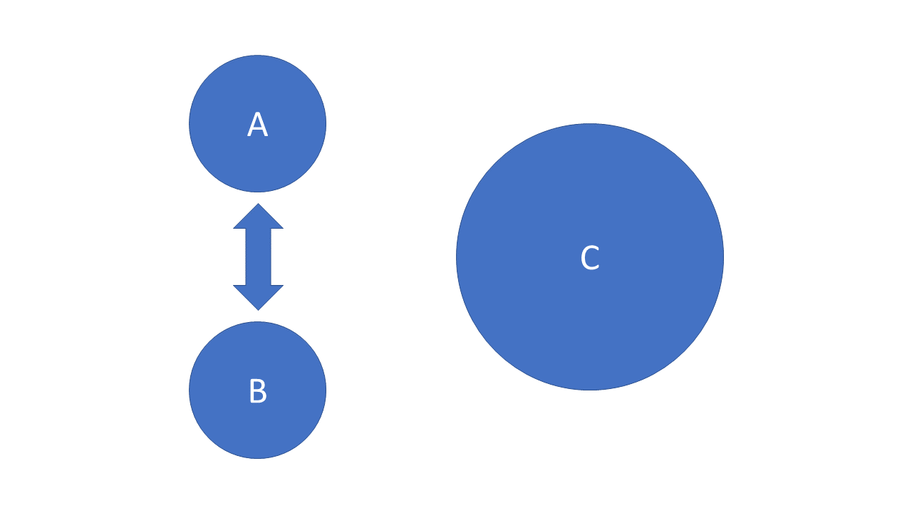

```{r setup, include = FALSE, echo = FALSE, message=FALSE, warning=FALSE}
library(tidyverse)
library(tidyquant)
library(plotly)
library(scales)
library(here)
library(Hmisc)
library(kableExtra)
library(knitr)
library(lubridate)
library(rgdal) # used to read world map data
library(rgeos) 
library(rvest)
library(broom)
library(troopdata)
library(maptools)
library(patchwork)
library(ggmap)
library(sp)
library(sf)
library(colorRamps)
library(ggtext)
library(RColorBrewer)
library(treemapify)
library(ggalluvial)
library(ggrepel)
library(brms)
library(tidybayes)
library(ggdist)
library(flynnprojects)


knitr::opts_chunk$set(fig.width=12, fig.height=8, fig.align="center", echo=FALSE, warning=FALSE, error=FALSE, message=FALSE, dpi=400) 

sysfonts::font_add_google("Oswald", family = "oswald")
showtext::showtext_auto()
showtext::showtext_opts(dpi = 300)


```

# Lecture Overview

1. What is security cooperation?

2. Alliances

3. Military deployments

4. Why do states cooperate?

5. Effects of security cooperation


---
class: left, top

# Key Questions

1. Why do states form alliances?

2. How do allies help redistribute the costs of war?

3. Why do states host military deployments?

4. What is the relationship between economic interests and security cooperation?

5. What are the differences between bilateral vs. multilateral security relationships?

6. What are the tradeoffs associated with the United States' security relationships?


---
class: top, left

# Key Concepts

1. Security cooperation

2. Alliance

3. Military deployment

4. Burden sharing

5. Security-sovereignty or security-autonomy tradeoff


---
class: center, middle, inverse

# What is security cooperation?


---
class: left, top

# What is security cooperation?

States may not agree on everything, but they often have shared interests

- Security cooperation involves states working together to promote their individual and joint security interests

- This can involve different sorts of activities:

  - Forming a military alliance
  - Hosting foreign military deployments
  - Military and economic aid
  - Military training and exercises
  - Professional military education
  - Sharing intelligence information


---
class: left, top

# What is security cooperation?

States may not agree on everything, but they often have shared interests

- Security cooperation involves states working together to promote their individual and joint security interests

- This can involve different sorts of activities:

  - .font-color-blue[Forming a military alliance]
  - .font-color-blue[Hosting foreign military deployments]
  - Military and economic aid
  - Military training and exercises
  - Professional military education
  - Sharing intelligence information


---
class: center, middle, inverse

# Military Alliances


---
class: left, top

# Military Alliances

.medium[
What are military alliances?

[Alliance Treaty Obligations and Provisions (ATOP)](chrome-extension://efaidnbmnnnibpcajpcglclefindmkaj/http://www.atopdata.org/uploads/6/9/1/3/69134503/atop_5_1_codebook.pdf) project defines alliances as:

> [W]ritten agreements, signed by official representatives of at least two independent states, that include promises to aid a partner in the event of military conflict, to remain neutral in the event of conflict, to refrain from military conflict with one another, or to consult/cooperate in the event of international crises that create a potential for military conflict 

]


---
class: left, top

# Military Alliances
.small[
Dimensions of alliances:

Commitment level (Depth)

  1. Defense
  2. Offense
  3. Neutrality
  4. Non-aggression
  5. Consultation
  
Membership (Breadth)

  1. Bilateral
  2. Multilateral
  
Relative capabilities (Power)

  1. Symmetric
  2. Asymmetric

]

---
class: center, middle

```{r ally count}

allydata <- read.csv(here("../../../Data Files/ATOP V4.0 Data (csv)/atop4_0ddyr.csv")) %>% 
  subset(stateA == 2 & defense == 1) %>% 
  group_by(year) %>% 
  summarise(allies = n_distinct(stateB))

combined <- tibble(year = seq(1815, 2016)) %>% 
  left_join(allydata) %>% 
  mutate(allies = ifelse(is.na(allies), 0, allies)) 


# US allies over time
ggplot(data = combined, aes(x = year, y = allies)) +
  geom_line(size = 1.5) +
  theme_flynn(base_family = "oswald", base_size = 12) +
  scale_x_continuous(breaks = seq(1815, 2016, 20)) +
  scale_y_continuous(breaks = seq(0, 70, 10), limits = c(0, 70)) +
  labs(x = "Year",
       y = "Count",
       title = "US defense pacts over time, 1815-2016",
       subtitle = "World War II and the Cold War mark an important turning point",
       caption = "Data obtained from the Alliance Treaty Obligations and Provisions Data (v4.0)")

```

???

# Notes

- US really stuck to the no entangling relations thing for a long time


---
class: center, middle

```{r ally region}

allydataregion <- read.csv(here("../../../Data Files/ATOP V4.0 Data (csv)/atop4_0ddyr.csv")) %>% 
  subset(stateA == 2 & defense == 1) %>% 
  group_by(year) %>% 
  mutate(region = countrycode::countrycode(stateB, "cown", "region")) %>% 
  group_by(region, year) %>% 
  summarise(allycount = sum(atopally, na.rm = TRUE)) %>% 
  filter(!is.na(region))


ggplot(allydataregion, aes(x = year, y = allycount, fill = region)) +
  geom_bar(position = "stack", stat = "identity", color = "black", size = 0.1) +
  scale_fill_brewer(palette = "Set2") +
  theme_flynn(base_family = "oswald", base_size = 12) + 
  labs(x = "Year",
       y = "Count",
       title = "US defense pacts by geographic region, 1942-2016",
       fill = "Region",
       subtitle = "What can the regional emphasis tell us about US priorities?",
       caption = "Data obtained from the Alliance Treaty Obligations and Provisions (ATOP) Dataset (v4.0).")

```


???
 

# Notes

- Looking at where allies are gives you a sense of regional priorities


---
class: center, middle, inverse

# Military Deployments


---
class: left, top
# Military Deployments

.small[
Let's define them first

> The permanent or temporary placement of military personnel and assets in a location outside of the United States and its territories.


Different types:

- Combat deployments
  - Large ground, air, and/or sea assault missions
  - Occupation and reconstruction missions
  - Smaller special operations forces

- Non-combat deployments
  - Military exercises
  - Humanitarian and civic-assistance exercises
  - Humanitarian and disaster relief
  - Professional military education (sort of)
  
- Marine Embassy Guards/Marine Security Guard
]


---
class: center, middle

```{r fig-time}
troops.data <- readxl::read_xls(here("../../../Data Files/troopMarch2005.xls"), sheet = 2)

time.data <- troops.data %>% 
  subset(Country == "TOTAL - WORLDWIDE" 
         | Country == "Total - Foreign (Sum)" 
         | Country  == "% Troops Foreign/Worldwide (Sum)" 
         | Country == "Total - Foreign (Ashore and Afloat)") %>%
  mutate_if(is.numeric, as.character) %>%
  mutate_if(is.double, as.character) %>% 
  select(2:58) %>% 
  pivot_longer(cols = c(`1950`:`2005`)) %>% 
  rename("year" = "name", "group" = "Country") %>% 
  mutate(group = factor(group, labels = c("Percent Overseas", "Total Foreign (A&A)", "Total Foreign", "Total Worldwide")),
         group = ordered(group, c("Total Worldwide", "Total Foreign (A&A)", "Total Foreign", "Percent Overseas")),
         value = as.numeric(paste(value)),
         year = as.numeric(paste(year)))


# total and overseas deployments
ggplot(data = subset(time.data, group == "Total Foreign" 
                     | group == "Total Worldwide"), aes(x = year, y = value, group = group, fill = group)) +
  geom_area(position = "identity", alpha = .8, color = "black", size = .1) +
  theme_flynn(base_family = "oswald", base_size = 12) +
  scale_y_continuous(breaks = seq(0, 3500000, 500000), labels = comma_format()) +
  scale_x_continuous(breaks = seq(1950, 2005, 5)) +
  scale_fill_brewer(palette = "Set2") +
  labs(x = "Year",
       y = "Count",
       fill = "Category",
       title = "US military personnel and overseas deployments, 1950-2005",
       subtitle = "A substantial portion of US personnel have been stationed overseas",
       caption = "Data obtained from https://www.heritage.org/defense/report/global-us-troop-deployment-1950-2003")


```


---
class: center, middle

```{r}

# percent overseas
ggplot(data = subset(time.data, group == "Percent Overseas"), aes(x = year, y = value/100, group = group, fill = group)) +
  geom_line(size = 1.5) + 
  theme_flynn(base_family = "oswald", base_size = 12) +
  scale_y_continuous(breaks = seq(.12, .32, .04), limits = c(.12, .32), labels = percent_format()) +
  scale_x_continuous(breaks = seq(1950, 2005, 5)) +
  labs(x = "Year",
       y = "",
       title = "US overseas deployments as a percent of all personnel, 1950-2005",
       subtitle = "A substantial portion of US personnel have been stationed overseas",
       caption = "Data obtained from https://www.heritage.org/defense/report/global-us-troop-deployment-1950-2003")

```


---
class: center, middle

```{r treepmap-plot}

#### Tree Map ####

troopdata <- troopdata::troopdata %>% 
  filter(ccode != 2 & year >= 1950) %>% 
  mutate(ccode = ifelse(ccode == 260, 255, ccode),
         region = countrycode::countrycode(iso3c, "iso3c", "region"),
         region = case_when(
           ccode == 1003 ~ "Afloat",
           ccode == 70 ~ "North America",
           region == "Latin America & Caribbean" ~ "Central & South America & Caribbean",
           TRUE ~ region))


treeplot.data <- troopdata %>% 
  filter(year %in% c(2000, 2005, 2010, 2015) & !is.na(troops) & !is.na(region)) %>% 
  mutate(countryname = countrycode::countrycode(ccode, "cown", "country.name"),
         countryname = ifelse(iso3c == "PRI", "Puerto Rico", countryname))

treemap.plot <- ggplot(treeplot.data, aes(area = troops, fill = region, label = iso3c)) +
  geom_treemap() +
  geom_treemap_text() +
  facet_wrap(. ~ year) +
  theme_flynn(base_family = "oswald", base_size = 12) +
  theme(legend.position = "bottom") +
  scale_fill_brewer(palette = "Spectral") +
  labs(fill = "Region")
  
treemap.plot

```


---
class: center, middle

```{r alluvial-plot}
alluvial.data <- peacesciencer::cow_alliance %>% 
  filter(year >= 2006 & ccode1) %>% 
  left_join(troopdata, by = c("ccode2" = "ccode", "year")) %>% 
  filter(!is.na(troops)) %>% 
  group_by(cow_defense, region, year) %>% 
  mutate(cow_defense = factor(cow_defense, levels = c(0, 1), labels = c("Non-Ally", "Ally"))) %>% 
  group_by(ccode2, year, cow_defense, region) %>% 
  pivot_longer(cols = c("army", "navy", "air_force", "marine_corps"),
               names_to = "branch",
               values_to = "level") %>% 
  dplyr::select(-c(ccode1,  cow_neutral, cow_nonagg, cow_entente)) %>% 
  filter(!is.na(level)) %>% 
  group_by(region, branch) %>% 
  dplyr::summarise(level = sum(level)) %>% 
  mutate(branch = factor(branch, levels = c("army", "air_force", "navy", "marine_corps"), labels = c("Army", "Air Force", "Navy", "Marine Corps")),
         region = factor(region, levels = c("North America", "Central & South America & Caribbean", "Europe & Central Asia", "Middle East & North Africa", "Sub-Saharan Africa", "East Asia & Pacific", "South Asia")))


alluvialplot <- ggplot(alluvial.data, aes(y = level, weight = level, axis1 = branch, axis2 = region, fill = branch)) +
  geom_alluvium(alpha = 0.5, width = 1/14) +
  geom_stratum(width = 1/12, fill = "gray80", color = "black", size = 0.1) +
  geom_label_repel(stat = "stratum", aes(label = ifelse(x == 1, after_stat(as.character(stratum)), NA), fill = branch, fontface = "bold"), size = 11, hjust = "left", nudge_x = -0.25, direction = "x", point.padding = 0, box.padding = 0.1, label.padding = 0.15, max.iter = Inf, show.legend = FALSE, alpha = 0.6) +
  geom_label_repel(stat = "stratum", aes(label = ifelse(x == 2, after_stat(as.character(stratum)), NA), fontface = "bold"), fill = "white", size = 11, hjust = "right", nudge_x = 0.38, direction = "y", point.padding = 0, box.padding = 0.1, label.padding = 0.15,  max.iter = Inf, min.segment.length = 0.15)+
  scale_y_continuous(expand = c(0.0, 0.0)) + 
  scale_x_continuous(expand = c(0.15, 0.25)) + 
  scale_fill_manual(values = c("#00308f", "#ffd530","#CC0000", "#088199")) +
  theme_flynn(base_family = "oswald", base_size = 12) +
  theme(legend.position = "bottom", 
        axis.text.x = element_blank(),
        axis.text.y = element_blank(),
        axis.title.y = element_blank(),
        axis.ticks = element_blank(),
        panel.grid.major = element_blank(),
        panel.grid.minor = element_blank(),
        panel.border = element_blank(),
        plot.background = element_blank()) +
  guides(label = FALSE) +
  labs(fill = "Service Branch",
       title = "Distribution of service branch personnel by region, 2006-2020")


alluvialplot
```


---
class: center, middle

<figure>

<figcaption>US, German, Spanish and Polish troops of the NATO enhanced Forward Presence battle groups with their tanks get ready for exercises in Adazi, Latvia. These 2018 exercises involved approximately 50,000 military personnel from 31 countries.</figcaption>
</figure>


---
class: center, middle

<figure>

<figcaption>U.S. Marines from 3rd Marine Expeditionary force deployed from Okinawa, Japan, participate in the winter military training exercise with South Korean soldiers on January 28, 2016 in Pyeongchang-gun, South Korea. U.S. and South Korean marines participate in the endurance exercise in temperature below minus 20 degrees celsius under a scenario to defend the country from any possible attacks from North Korea. (Photo by Chung Sung-Jun/Getty Images)</figcaption>
</figure>


---
class: center, middle

<figure>

<figcaption>U.S. High Mobility Artillery Rocket System (HIMARS) firing inside Ukraine. Photo obtained from Ukrainian Ministry of Defense/Twitter via Task and Purpose https://taskandpurpose.com/news/us-military-sending-atacms-missiles-to-ukraine-reports/</figcaption>
</figure>


---
class: center, middle

<figure>

<figcaption>LAGUNA DEL RINCON, Honduras - Army Staff Sgt. Robyn Porter of the 478th Civil Affairs Battalion of Miami, Florida and Army Reserve Sgt. Mitzi Porter of the 993rd Medical Detachment (Veterinary Services) of Aurora, Colo. administer medication to a dog during their visit to this rural town. Veterinarians, like the two Porters, provided basic medical and dental care to dogs, cats and livestock during daylong visits to this and other remote Honduran villages. U.S. military medical personnel are in Honduras for the joint training exercise Beyond the Horizon. The event provides medical attention, as well as infrastructure renovation, to rural areas in this Central American country. (Photo by Sgt. Claude W. Flowers, 304th Public Affairs Detachment.)</figcaption>
</figure>


---
class: center, middle, inverse

# Why do states cooperate?


---
class: left, top

# Why do states cooperate?

Lots of reasons:

- Balance against power/threat
- Aggregate capabilities
- Increase security
- Signal credibility
- Signal resolve
- Facilitate power projection capabilities
- Crisis intervention
- Train host-state personnel
- Field experience/training for US personnel
- Humanitarian operations
- Secure trade and investment relationships
- Promote interoperability 


---
class: center, middle




???

# Notes

- Realist thinking often talked about alliances in the context of balance of power
- States ally with one another to check another, bigger country.
- It's about the aggregation of capabilities


---
class: left, top

# Why do states cooperate?

Burden sharing

- Distribute the costs of military operations

- Defense

- Offense

- Deter Adversaries

- Coordinate capabilities 

???

# Notes

- States also ally for a number of other reasons
- Burden sharing is the idea that allies distribute the costs of military operations across the member states
- This doesn't mean it's going to be evenly distributed by any means, but helps to reduce burden on any one state


---
class: center, middle

```{r}

fat.data <- readxl::read_xlsx(here("../../../Data Files/icasualties/afghan-iraq-fatalities.xlsx")) %>%
  mutate(NonUS = Total - US) %>% 
  select(Year, War, US, NonUS) %>% 
  pivot_longer(cols = c(3,4),
               names_to = "country",
               values_to = "deaths")

ggplot(fat.data, aes(x = Year, y = deaths, fill = country)) +
  geom_bar(stat = "identity", position = "stack", color = "black", size = 0.1) +
  facet_wrap(. ~ War) +
  theme_flynn(base_family = "oswald", base_size = 12) +
  scale_fill_brewer(palette = "Set2") +
  labs(x = "Year",
       y = "Count",
       fill = "Country",
       title = "Coalition deaths in Afghanistan and Iraq, 2001-2020",
       caption = "Data obtained from icasualties.org")


```


???

# Notes

- Example of burden sharing in Afghanistan and comparison case of Iraq
- In Afghanistan US endured majority of casualties, but coalition partners also took on a sizeable share of casualties
- In Iraq the US went in with relatively few partner states dedicated to combat operations
- Note this doesn't include other areas of burden sharing like financial support


---
class: center, middle

```{r coalition fatalities percent}

fat.perc <- readxl::read_xlsx(here("../../../Data Files/icasualties/afghan-iraq-fatalities.xlsx")) %>%
  mutate(percent = US/Total)

ggplot(fat.perc, aes(x = Year, y = percent, color = War, linetype = War)) +
  geom_line(size = 1.5) +
  theme_flynn(base_family = "oswald", base_size = 12) +
  scale_color_brewer(palette = "Set2") +
  scale_y_continuous(labels = percent_format()) +
  scale_x_continuous(breaks = seq(2000, 2020, 4)) +
  guides(linetype = FALSE) +
  labs(x = "Year",
       y = "Percent",
       color = "Conflict",
       title = "US fatalities as a percentage of total coalition fatalities",
       subtitle = "Coalition warfighting can spread risk to many states.",
       caption = "Data obtained from icasualties.org")
```


???

# Notes

- Another example from Iraq and Afghanistan
- US fatalities consistently high as a percentage of total fatalities in Iraq
- In Afghanistan allied states suffered a much higher proportion of the total casualties over time, particularly during the "surge" years around 2009 and 2010.


---
class: left, top

# Why do states cooperate?


.pull-left[
Burden sharing: What it's not

- A point of conflict among NATO members in recent years

- President Trump repeatedly criticized NATO for taking advantage of the US

- Has pressed allies to give US more in exchange for "protection"

To right: President Trump at a NATO summit with other alliance member leaders in Brussels, 2018.
]

.pull-right[

]


???

# Notes

- Burden sharing can and does vary considerably over time and context
- Nothing in the NATO treaty requires a certain contribution by allied states in wartime. Wartime contributions are determined by political factors on a rolling basis. 
- Burden sharing is also not a protection racket. Member states do split the costs of NATO's operating budget, but this is relatively small.
- When we talk about meeting commitments we're talking about individual countries increasing their own defense budgets, and perhaps dedicating spending to particular categories of defense, like R&D, manpower, equipment, etc.
  - 2014 Wales Summit called for members to spend 2% of their GDP on defense, and 20% of their budgets on major equipment and R&D.
  - Also calls for allies not meeting this threshold to halt their decline and increase real expenditures as GDP grows.
  - Sets longterm time frame for meeting these obligations.
- Countries do not pay the US for protection


---
class: center, middle

```{r nato-votes}

natodata <- readxl::read_xlsx(here("../../../Projects/Republican opposition to multilateralism/Data/NATO Voting/Data/NATO Votes Compiled 20180412.xlsx")) %>% 
  subset(select = c("congress", "date", "expansion_mf", "limits_mf", "allied_contributions_mf", "general_participation_mf")) %>% 
  gather(., group, count, -congress, -date) %>% 
  ungroup() %>% 
  mutate(Category = factor(group, labels = c("Allied Contributions", "NATO Expansion", "US Limits", "All Votes")),
         Year = as.numeric(format(date, "%Y")) )


# All votes concerning NATO by year
ggplot(data = natodata %>% filter(Category != "All Votes"), aes(x = Year, y = count, fill = Category)) +
  geom_bar(stat = "identity", position = "stack", size = 0.1) +
  theme_flynn(base_family = "oswald", base_size = 12) +
  scale_x_continuous(breaks = seq(1950, 2015, 5)) +
  scale_y_continuous(breaks = seq(0, 15, 5), limits = c(0,15)) +
  scale_fill_brewer(palette = "Set2") +
  labs(x = "Congress", 
       y = "Vote Count",
       title = "Voting in US Congress on NATO by subject, 1949-2017",
       subtitle = "The end of the Cold War saw a surge in activity relatd to NATO",
       caption = "Data collected from descriptions of legislation obtained through voteview.com")


```

???

# Notes

- Politicians have long been concerned about free riding and the idea that the US will be exploited by other countries
- Trump gets a lot of attention because he says things that are wildly incorrect with respect to how the alliance functions, but these concerns are not new.
- Figure shows periods where members of Congress have proposed legislation addressing various aspects of NATO and US participation.
- Note that concerns about US limits (what it will contribute, etc.) have been raised frequently
- Vandenberg Resolution during the negotiations over US membership in NATO required "self-help" language because Republican legislators worried about Europeans taking advantage of the US.


---
class: left, top

# Why do states cooperate?

.pull-left[
Influence and control

- Most alliances are **asymmetric alliances**

- Security ties can allow members to exert influence on other member states

- Example: NATO

  - Intended to deter Russian aggression 

  - Also intended to facilitate cooperation among European countries

To right: Lord Hastings Lionel Ismay, first Secretary General of NATO
]

.pull-right[

]


???

# Notes

- The US also had influence because of its overwhelming power and the peripheral goals of the NATO alliance
- Lord Hastings Lionel Ismay, first Secretary General of NATO, said the alliance's purpose was "to keep the Soviet Union out, the Americans in, and the Germans down."

  


---
class: left, top

# Why do states cooperate?

.pull-left[
So what does this look like?

- The US has alliance agreements with a lot of different countries

- As a part of these agreements the US often gets access to territory for things like military bases

- Alliance agreements might also be used to shape other states' security policies in related areas

To right: President Gerald Ford with South Korean President Park Chung-hee in Seoul, 1974. Photo courtesy of George Washington University National Security Archives.
]

.pull-right[

]


???

# Notes
- Example: The US was able to stop South Korea's development of nuclear weapons
- Nixon Administration shifts policy to place a greater responsibility on allied states for their own self defense.
- The US removed thousands of personnel from South Korea in the early 1970s following Nixon's trip to China and easing of tensions.
- South Korean government perceived the US commitment to its security as weakening, and so it began to explore the development of a nuclear weapons program. 
- The US threatened to withdraw all forces from the Korean Peninsula if the South Korean Government didn't abandon the program. President Ford also indicated the US would impose economic sanctions/punishment on South Korea if it didn't abandon the program. The US also intervened to stop the sale of technology to South Korea necessary to advance its weapons development.


---
class: center, middle, inverse

# Effects of security cooperation


---
class: left, top

# Effects of security cooperation

Security cooperation has effects across a number of dimensions

- Security effects

- Economic effects

- Public opinion


---
class: left, top

# Effects of security cooperation

Security Effects

- Reduced military spending (for most) and a smaller host-state military

- Effect is also context-dependent

- Some increased likelihood of conflict


---
class: center, middle


---
class: center, middle


---
class: top, left

# Effects of security cooperation

Security cooperation doesn't just serve security goals

Alliances and deployments are related to a broader range of states' policy goals

- Security relationships affect economic and political relationships

- But economic and political relationships also affect security relationships

"Issue linkage" 

???
# Notes

- Military alliances serve broader goals---not just security goals
- Issue linkage: The concept that the politics of some issue areas are tied to the politics of other issue areas. Vague definition, but the idea is that security affects economics, and economics affects security.


---
class: left, top

# Effects of security cooperation

"Guns vs Butter" framework

- States have things they want to do, but have limited resources

- This means they have to strike a balance, or mixture, of policy outputs with those limited resources

- Allied state gives up some control over its foreign policy for greater security

- This lets the allied state shift resources away from defense to other policy areas *while not reducing overall policy outputs*

???
# Notes

- Guns vs Butter framework is just the idea that, under budgetary constaints, policymakers face a tradeoff between spending on security and spending on domestic welfare programs.
 - The security-autonomy tradeoff comes into play here: States can increase security by allying with a major power, allowing them to shift budgetary resources to alternative policy goals. The price is they lose some foreign policy autonomy.
 - This tradeoff might not matter much if states don't have grand ambitions.


---
class: center, middle


---
class: center, middle


---
class: center, middle


---
class: center, middle

```{r allied trade}
library(tidyquant)

cpi <- tq_get("CPIAUCNS",
              get = "economic.data",
              from = "1913-01-01",
              to = "2019-01-01") %>% 
  mutate(year = as.numeric(format(date, "%Y")),
         basevalue = mean(price[year==2018]),
         cpi = price/basevalue) %>% 
  group_by(year) %>% 
  summarise(cpi = mean(cpi))

allyid <- read_csv(here("../../../Data Files/ATOP V4.0 Data (csv)/atop4_0ddyr.csv")) %>% 
  subset(stateA == 2 & defense == 1) %>% 
  group_by(year) %>% 
  select(stateB, year, defense) %>% 
  rename("ccode" = "stateB")

tradedata <- read_csv(here("../../../Data Files/COW Data/COW_Trade_4.0/National_COW_4.0.csv")) %>% 
  filter(year >= 1950 & ccode != 2)

combined <- tradedata %>% 
  left_join(allyid, by = c("ccode", "year")) %>% 
  left_join(cpi, by = c("year")) %>% 
  mutate(defense = ifelse(is.na(defense), 0 , defense),
         exports_con = exports/cpi,
         imports_con = imports/cpi,
         total_trade = exports + imports,
         total_trade_nochina = ifelse(ccode != 710, exports + imports, NA)) %>% 
  group_by(defense, year) %>% 
  summarise(meantrade = mean(total_trade, na.rm = TRUE),
            meantrade_nochina = mean(total_trade_nochina, na.rm = TRUE)) %>% 
  group_by(defense) %>% 
  mutate(defense = factor(defense, levels = c(0, 1), labels = c("Non-US Allies", "US Allies")),
         index = (meantrade/meantrade[year==1950])*100,
         index_nochina = (meantrade_nochina/meantrade_nochina[year==1950]*100))


ggplot() +
  geom_line(data = combined, aes(x = year, y = index, linetype = defense, color = defense), size = 1.5) +
  geom_line(data = combined %>% filter(defense == "Non-US Allies"), aes(x = year, y = index_nochina, linetype = "longdash", color = "Non-US Allies (No China)"), size = 1.5) +
  theme_flynn(base_family = "oswald", base_size = 12) +
  scale_x_continuous(breaks = seq(1950, 2020, 5)) +
  scale_y_continuous() +
  scale_color_brewer(palette = "Set2") +
  guides(linetype = FALSE) +
  labs(x = "Year",
       y = "Index",
       color = "Ally Type",
       title = "Index of monadic trade for US allies and non-allied states, 1950-2016",
       subtitle = "Index tracks mean level of total monadic trade over time",
       caption = "Trade data taken from Correlates of War Trade Data (v4.0)\nAlliance data taken from Alliance Treaty Obligations and Provisions (ATOP) data (v4.0).\nTrade data defalted to constant 2018 dollars using CPI data from FRED database.")
  


```

???

# Notes

- Figure hows the gap in trade between US allies and non-allies in terms of global trade (includes exports and imports)
- The gap starts to close in more recent years, but a lot of this is driven by China (see th eline that removes China to get a sense of its effect on the final line)
- The basic idea here is that having security provisions from a country like the Untied States can make other countries more desirable for trade and investment relationships. If investors know that these are stable countries, they're more likely to invest the time and money into setting up the infrastructure to trade and invest.
- US alliance relationships are also often set up to protect commercial interests/activity.


---
class: center, middle

```{r network figure}

library(network)

# Do it for all states
tradedyad <- read_csv(here("../../../Data Files/COW Data/COW_Trade_4.0/Dyadic_COW_4.0.csv")) %>% 
  filter(year >= 1950) %>% 
  select(importer1, importer2, flow1, flow2, year) %>% 
  mutate(year = year - min(year),
         trade = flow1 + flow2,
         trade = ifelse(trade == 0, NA, trade)) %>% 
  select(importer1, importer2, trade, year) # remember to order these correctly. Node 1, Node 2, then attributes/connections

netlist <- list()
denslist <- list()

for (i in 1:61) {
  
data <- tradedyad %>% filter(year == i) # Filter out observed year

nodelist.1 <- data$importer1 # Generate list of nodes
nodelist.2 <- data$importer2 # Data aren't directed so we need to capture both columns

nodelist <- tibble(label = unique(c(nodelist.1, nodelist.2))) %>% # Combine node lists into single vector
  arrange(label) %>% 
  rowid_to_column("id") # IMPORTANT: Generate ID column to correspond to text label

edges <- data %>%  # Create edgelist
  left_join(nodelist, by = c("importer1" = "label")) %>% # Have to match labels to importer name
  rename("from" = "id")

edges <- edges %>% 
  left_join(nodelist, by = c("importer2" = "label")) %>% 
  rename("to" = "id") %>% 
  filter(!is.na(trade) & trade > 0) # Get rid of observations with NA or 0 values for trade. These count as edges even if value is NA.

edges <- select(edges, from, to, trade) # Whittle down edgelist. Order is important.

netlist[[i]] <- network(edges, 
                        matrix.type = "edgelist", 
                        vertex.attr = nodelist,
                        directed = FALSE,
                        na.omit = FALSE,
                        ignore.eval = FALSE)

}

for (i in 1:61) {
  denslist[[i]] <- network.density(netlist[[i]],
                                   na.omit = FALSE)
}

den.df <- do.call("rbind", denslist) %>% 
  as.data.frame() %>% 
  mutate(year = row_number(.) + 1949,
         ally = "All States") %>% 
  rename("density" = "V1")


# Do it for US Allies only

allyid <- read_csv(here("../../../Data Files/ATOP V4.0 Data (csv)/atop4_0ddyr.csv")) %>% 
  subset(stateA == 2 & defense == 1) %>% 
  select(stateB, year, defense) %>% 
  rename("ccode1" = "stateB") %>%
  mutate(ccode2 = ccode1) %>% 
  filter(year >= 1950)


tradedyad <- read_csv(here("../../../Data Files/COW Data/COW_Trade_4.0/Dyadic_COW_4.0.csv")) %>% 
  filter(year >= 1950) %>% 
  left_join(allyid, by = c("ccode1", "year")) %>% 
  select(-c("ccode2.y")) %>% 
  rename("ccode2" = "ccode2.x") %>% 
  left_join(allyid, by = c("ccode2", "year")) %>% 
  mutate(jointally = ifelse(defense.x == 1 & defense.y == 1, 1, 0)) %>% 
  filter(jointally == 1) %>% 
  select(importer1, importer2, flow1, flow2, year) %>% 
  mutate(year = year - min(year),
         trade = flow1 + flow2,
         trade = ifelse(trade == 0, NA, trade)) %>% 
  select(importer1, importer2, trade, year) # remember to order these correctly. Node 1, Node 2, then attributes/connections


netlist <- list()
denslist <- list()

for (i in 1:61) {
  
data <- tradedyad %>% filter(year == i) # Filter out observed year

nodelist.1 <- data$importer1 # Generate list of nodes
nodelist.2 <- data$importer2 # Data aren't directed so we need to capture both columns

nodelist <- tibble(label = unique(c(nodelist.1, nodelist.2))) %>% # Combine node lists into single vector
  arrange(label) %>% 
  rowid_to_column("id") # IMPORTANT: Generate ID column to correspond to text label

edges <- data %>%  # Create edgelist
  left_join(nodelist, by = c("importer1" = "label")) %>% # Have to match labels to importer name
  rename("from" = "id")

edges <- edges %>% 
  left_join(nodelist, by = c("importer2" = "label")) %>% 
  rename("to" = "id") %>% 
  filter(!is.na(trade) & trade > 0) # Get rid of observations with NA or 0 values for trade. These count as edges even if value is NA.

edges <- select(edges, from, to, trade) # Whittle down edgelist. Order is important.

netlist[[i]] <- network(edges, 
                        matrix.type = "edgelist", 
                        vertex.attr = nodelist,
                        directed = FALSE,
                        na.omit = FALSE,
                        ignore.eval = FALSE)

}

for (i in 1:61) {
  denslist[[i]] <- network.density(netlist[[i]],
                                   na.omit = FALSE)
}

den.df.allies <- do.call("rbind", denslist) %>% 
  as.data.frame() %>% 
  mutate(year = row_number(.) + 1949,
         ally = "Allies") %>% 
  rename("density" = "V1")


# Do it for Non-Allies only

allyid <- read_csv(here("../../../Data Files/ATOP V4.0 Data (csv)/atop4_0ddyr.csv")) %>% 
  subset(stateA == 2 & defense == 1) %>% 
  select(stateB, year, defense) %>% 
  rename("ccode1" = "stateB") %>%
  mutate(ccode2 = ccode1) %>% 
  filter(year >= 1950)


tradedyad <- read_csv(here("../../../Data Files/COW Data/COW_Trade_4.0/Dyadic_COW_4.0.csv")) %>% 
  filter(year >= 1950) %>% 
  left_join(allyid, by = c("ccode1", "year")) %>% 
  select(-c("ccode2.y")) %>% 
  rename("ccode2" = "ccode2.x") %>% 
  left_join(allyid, by = c("ccode2", "year")) %>% 
  mutate(jointally = ifelse(defense.x == 1 & defense.y == 1, 1, 0)) %>% 
  filter(is.na(jointally)) %>% 
  select(importer1, importer2, flow1, flow2, year) %>% 
  mutate(year = year - min(year),
         trade = flow1 + flow2,
         trade = ifelse(trade == 0, NA, trade)) %>% 
  select(importer1, importer2, trade, year) # remember to order these correctly. Node 1, Node 2, then attributes/connections


netlist <- list()
denslist <- list()

for (i in 1:61) {
  
data <- tradedyad %>% filter(year == i) # Filter out observed year

nodelist.1 <- data$importer1 # Generate list of nodes
nodelist.2 <- data$importer2 # Data aren't directed so we need to capture both columns

nodelist <- tibble(label = unique(c(nodelist.1, nodelist.2))) %>% # Combine node lists into single vector
  arrange(label) %>% 
  rowid_to_column("id") # IMPORTANT: Generate ID column to correspond to text label

edges <- data %>%  # Create edgelist
  left_join(nodelist, by = c("importer1" = "label")) %>% # Have to match labels to importer name
  rename("from" = "id")

edges <- edges %>% 
  left_join(nodelist, by = c("importer2" = "label")) %>% 
  rename("to" = "id") %>% 
  filter(!is.na(trade) & trade > 0) # Get rid of observations with NA or 0 values for trade. These count as edges even if value is NA.

edges <- select(edges, from, to, trade) # Whittle down edgelist. Order is important.

netlist[[i]] <- network(edges, 
                        matrix.type = "edgelist", 
                        vertex.attr = nodelist,
                        directed = FALSE,
                        na.omit = FALSE,
                        ignore.eval = FALSE)

}

for (i in 1:61) {
  denslist[[i]] <- network.density(netlist[[i]],
                                   na.omit = FALSE)
}

den.df.nonallies <- do.call("rbind", denslist) %>% 
  as.data.frame() %>% 
  mutate(year = row_number(.) + 1949,
         ally = "Non-Allies") %>% 
  rename("density" = "V1")


# Bring different network density measures together
density.df <- bind_rows(den.df, den.df.allies, den.df.nonallies)

ggplot(density.df, aes(x =  year, y = density, color = ally, linetype = ally)) +
  geom_line(size = 2) +
  theme_flynn(base_family = "oswald", base_size = 12) +
  scale_x_continuous(breaks = seq(1950, 2020, 5)) +
  scale_color_brewer(palette = "Set2") +
  guides(linetype = FALSE) +
  labs(x = "Year",
       y = "Network Density",
       color = "Alliance Relationship",
       title = "US alliance relationships and trade network density, 1950-2016",
       subtitle = "Alliance relationships reinforce other types of relationships",
       caption = "Network density calculted using 'network' package in R (v4.0.1).\nTrade data obtained from COW dyadic trade data (v4.0)\nAlliance data obtained from ATOP data (v4.0).")
```


???
# Notes

- US alliance relationships are also often set up to protect commercial interests/activity
- This figure shows the density of trade ties between groups of states
- Density refers to the proportion of all possible ties that we observe. So if we had four countries and three sets of connections, that would be a density of 50% or 0.50. 
- Number of dyads calculated as( N * N-1)/2 or (4 * 3)/2 in this example


---
class: left, top

# Effects of security cooperation

### Economic effects

Evidence of:

- Higher economic growth
- Higher infrastructure growth
- Higher levels of trade between US and host country
- Higher levels of FDI into host country
- Evidence of increased trade between third-party states


---
class: left, top

# Effects of security cooperation


### Economic effects

So what's the causal link?

1. Deployments signal stability, prompting investment?
2. Diffusion of technology and expertise?
3. Increasing demand by increasing consumer pool?


---
class: center, middle


```{r spending level}

spend1 <- read_csv(here("../../../Projects/Minerva grant documents/Papers/Published/Primary Paper - Contact/apsr-replication-files/apsr-data/spending-overseas-20191205.csv"))

library(colorRamps)
library(RColorBrewer)
getPalette = colorRampPalette(brewer.pal(9, "Set1"))
colourCount = length(unique(spend1$country))

# Line chart by country
# Note I needed a custom Brewer palette here because there were too many countries
ggplot(data = spend1, aes(x = year, y = total, group = as.factor(country), colour = as.factor(country), linetype = as.factor(country))) +
  geom_line(size = 1.5)+
  theme_flynn(base_family = "oswald", base_size = 12) +
  scale_x_continuous(breaks = seq(2013, 2020, 1)) +
  scale_y_continuous(labels = scales::dollar) +
  labs(y = "Millions of current dollars",
       x = "Year",
       color = "Country",
       linetype = "Country",
       title = "Total cost of maintaining US military presence in select countries, 2013-2020",
       subtitle = "Note that the total cost does not equate to how much the US actually spends",
       caption = "Data obtained from US Department of Defense Office of the Comptroller.") +
  scale_colour_manual(values = getPalette(colourCount)) 


```


---
class: center, middle

```{r operations and maintenance 1}

library(colorRamps)
library(RColorBrewer)
getPalette = colorRampPalette(brewer.pal(9, "Set1"))
colourCount = length(unique(spend1$country))

opmain.ts <- read.csv("../../../Projects/Minerva grant documents/Military Spending/operations-and-maintenance/data_spend_geocoded.csv") %>% 
  mutate(country = countrycode::countrycode(ccode, 'cown', 'country.name')) 

ggplot(opmain.ts, aes(x = factor(year), y = toa.mean, color = country)) +
  geom_jitter(width = 0.2, height = 2, size = 3, alpha = 0.8) +
  theme_flynn(base_family = "oswald", base_size = 12) + 
  scale_y_continuous(labels = dollar_format()) +
  scale_color_manual(values = getPalette(colourCount)) +
  labs(x = "Year",
       y = "Thousands of current dollars",
       color = "Country",
       title = "US military construction spending in select countries, 2008-2019")

```


---
class: center, middle

```{r operations and maintenance}

opmain <- read.csv("../../../Projects/Minerva grant documents/Military Spending/operations-and-maintenance/data_spend_geocoded.csv") %>% 
  mutate(country = countrycode::countrycode(ccode, 'cown', 'country.name'))

map <- map_data("world")

# World
ggplot() + 
  geom_polygon(data = map, aes(x = long, y = lat, group = group), colour = "black", size = .1, fill = "gray90") +
  geom_point(data = opmain, aes(x = lon, y = lat, size = toa.sum), color = "red3", alpha = .4) +
  theme_flynn(base_family = "oswald", base_size = 12) +
  scale_x_continuous(breaks = seq(-20, 180, 40)) +
  scale_y_continuous(breaks = seq(-40, 80, 40)) +
  coord_fixed(xlim = c(-20, 180), ylim = c(-40, 80)) +
  scale_size_continuous(labels = comma_format()) +
  labs(title = "US military construction spending, 2008-2018",
       x = "Longtitude",
       y = "Latitude") +
  guides(size = FALSE)

```


---
class: center, middle


```{r south america map}

sam <- readxl::read_xlsx(here("../../../Projects/Troops and Development/Data/SOUTHCOM Data/District Year List_AdamsCoding.xlsx")) %>% 
  group_by(Country) %>% 
  summarise(deploymentcount = n_distinct(Year)) %>% 
  filter(!is.na(Country)) 

map.sa <- map_data("world") %>% 
  mutate(ccode = countrycode::countrycode(region, "country.name", "cown")) %>% 
  filter(ccode >= 90 & ccode <= 199 | region == "French Guiana") %>% 
  left_join(sam, by = c("region" = "Country"))

ggplot() + 
  geom_polygon(data = map.sa, aes(long, lat, group = group, fill = deploymentcount), color = "black", size = 0.1) +
  coord_fixed(ratio = 1.3) +
  theme_flynn_map() +
  scale_fill_distiller(na.value = "gray90", palette = 3, direction = 1) +
  labs(fill = "Number of Annual\nDeployments",
       title = "US humanitarian and civic-assistance exercises by country, 2007-2015")

```


---
class: center, middle

```{r peru map}
library(raster)
library(broom)

peru <- getData("GADM", country = "PE", level = 1)

peru.regions <- as.data.frame(peru@data) %>% 
  dplyr::select(NAME_1, CC_1)

peru.deploy <- readxl::read_xlsx(here("../../../Projects/Troops and Public Opinion in Latin America/Data/Raw Data/SOUTHCOM Data/Deployment_Master-AliCopy-June2017.xlsx")) %>% 
  filter(Country == "Peru") %>% 
  group_by(Region) %>% 
  mutate(deploy = 1) %>% 
  dplyr::summarise(deploymentcount = sum(deploy))

peru.regions.c <- peru.regions %>% 
  left_join(peru.deploy, by = c("NAME_1" = "Region")) %>% 
  mutate(deploymentcount = ifelse(NAME_1 == "Lima Province", 4, deploymentcount))


peru.final.df <- broom::tidy(peru, region = "NAME_1") %>% 
  left_join(peru.regions.c, by = c("id" = "NAME_1"))

ggplot(peru.final.df) +
  geom_polygon(aes(x = long, y = lat, group = group, fill = deploymentcount), color = "black", size = 0.1) +
  coord_fixed(ratio = 1.3) +
  scale_fill_distiller(palette = 3, direction = 1, na.value = "gray90") +
  theme_flynn_map() +
  labs(fill = "Deployment count",
       title = "Humanitarian and civic-assistance deployments to Peru, 2007-2015")


```


---
class: top, left

# Effects of security cooperation

- Positive externalities

  - Security?
  - Investment?
  - Jobs?

- Negative externalities

  - Moral hazard?
  - Crime?


---
class: center, middle


```{r}
base.data <- troopdata::get_basedata(host = 255)

# load troop data
germany.troop.fig <- troopdata::get_troopdata(host = 255, startyear = 2020, endyear = 2020) %>% 
  mutate(troops = comma(troops))

load(here::here("../../../Projects/Minerva grant documents/Book/Data/General/opinion.data.RData"))

opinion.data <- o.data %>% 
  filter(ccode == 255) %>% 
  group_by(province) %>%
  mutate(pos.gov = case_when(
    american_g_cat == "pos" ~ 1,
    TRUE ~ 0
  ),
  pos.troops = case_when(
    troops_1_cat == "pos" ~ 1,
    TRUE ~ 0
  ),
  pos.people = case_when(
    american_p_cat == "pos" ~ 1,
    TRUE ~ 0
  )) %>% 
  dplyr::summarise(perc.pos.gov = (sum(pos.gov)/length(pos.gov)),
                   perc.pos.people = (sum(pos.people)/length(pos.people)),
                   perc.pos.troops = (sum(pos.troops)/length(pos.troops))) |> 
  filter(!is.na(province))

map.germany <- geodata::gadm(country = "DEU", level = 1, path = here::here()) |> 
  sf::st_as_sf() |> 
  fuzzyjoin::stringdist_left_join(opinion.data, by = c("NAME_1" = "province"))


map.people <- ggplot() +
  geom_sf(data = map.germany, aes(geometry = geometry, fill = perc.pos.people), color = "black", size = 0.1) +
  geom_point(data = base.data, aes(x = lon, y = lat), color = "red", size = 4, alpha = 0.5) +
  coord_sf() +
  theme_flynn_map() +
  viridis::scale_fill_viridis(direction = 1, limits = c(0, 0.55), labels = scales::percent_format()) +
  labs(fill = "Percent",
       title = "U.S. people")
  


map.gov <- ggplot() +
  geom_sf(data = map.germany, aes(geometry = geometry, fill = perc.pos.gov), color = "black", size = 0.1) +
  geom_point(data = base.data, aes(x = lon, y = lat), color = "red", size = 4, alpha = 0.5) +
  coord_sf() +
  theme_flynn_map() +
  viridis::scale_fill_viridis(direction = 1, limits = c(0, 0.55), labels = scales::percent_format()) +
  labs(fill = "Percent",
       title = "U.S. government")
  


map.troops <- ggplot() +
  geom_sf(data = map.germany, aes(geometry = geometry, fill = perc.pos.troops), color = "black", size = 0.1) +
  geom_point(data = base.data, aes(x = lon, y = lat), color = "red", size = 4, alpha = 0.5) +
  coord_sf() +
  theme_flynn_map() +
  viridis::scale_fill_viridis(direction = 1, limits = c(0, 0.55), labels = scales::percent_format()) +
  labs(fill = "Percent",
       title = "U.S. troops")
  


# One map to rule them all
map.com <- patchwork::wrap_plots(map.troops, map.gov, map.people) + 
  patchwork::plot_layout(guides = "collect") +
  patchwork::plot_annotation(title = glue::glue("<span style='font-size:65pt; color: #000000'>**German Attitudes Towards U.S. Actors**</span><br>",
                               "<span style='font-size:40pt; color: #778899;'>_The figure shows the percent of respondents in each region expressing a 'very positive' or 'somewhat positive' view of the referent group. Red dots show location of U.S. military facilities from Vine (2015). As of 2020 there were {germany.troop.fig$troops} U.S. personnel in Germany. Surveys conducted by the authors from 2018-2020._</span>"),
                  theme = theme_flynn_map()) &
  theme_flynn_map() &
  theme(legend.position = "bottom",
        legend.title = element_text(face = "bold", lineheight = 0.5),
        legend.text = element_text(size = 25),
          legend.key.height = unit(0.6, "cm"),
          legend.key.width = unit(2.5, "cm"),
        plot.title = element_textbox_simple(
          lineheight = 0.5,
          padding = margin(2, 2, 2, 2),
          margin = margin(0, 0, 0, 0),
          fill = "white"))

map.com

```
